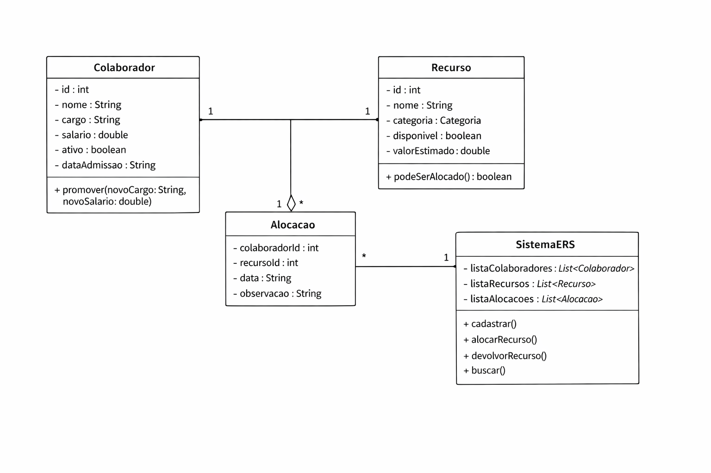

# 🏢 ERS — Employee Resource System

## 📌 Visão Geral

O **ERS (Employee Resource System)** é um sistema desenvolvido em **Java puro** com o objetivo de simular o núcleo de gestão de colaboradores e recursos internos de uma empresa.

Este projeto representa um módulo central que pode ser utilizado por diversos setores corporativos como:

* Recursos Humanos (RH)
* Financeiro
* Facilities
* Compras
* Segurança
* Operações

A aplicação foi construída utilizando apenas conceitos fundamentais da linguagem Java, sem o uso de frameworks ou banco de dados, focando em **orientação a objetos e regras de negócio**.

---

## 🌍 Cenário Corporativo

Em empresas reais, a gestão de ativos e colaboradores é essencial para garantir:

* Controle eficiente de equipamentos (notebooks, celulares, etc.)
* Redução de custos operacionais
* Segurança da informação
* Governança e rastreabilidade de recursos
* Organização do ciclo de vida do colaborador

### 🔍 Como empresas reais lidam com isso?

#### 📦 Inventário de Ativos

Empresas utilizam sistemas como CMDB (Configuration Management Database) para registrar todos os ativos, incluindo:

* Identificação única
* Categoria
* Valor
* Status (disponível, alocado, manutenção)

➡️ **Inspiração no projeto:** Classe `Recurso` com controle de disponibilidade e valor.

---

#### 💻 Controle de Equipamentos

Políticas corporativas determinam quem pode usar quais equipamentos.

➡️ **Inspiração no projeto:**

* Método `podeSerAlocado()`
* Validação de disponibilidade

---

#### 🔐 Governança e Segurança

Recursos de alto valor exigem aprovação especial.

➡️ **Inspiração no projeto:**

* Regra: recursos com valor > 5000 não podem ser alocados diretamente

---

#### 👨‍💼 Ciclo de Vida do Colaborador

Inclui:

* Onboarding (entrada)
* Promoções

➡️ **Inspiração no projeto:**

* Colaborador inicia como `ativo = true`
* Método `promover()`

---

## 🎯 Objetivo do Sistema

Desenvolver um módulo funcional capaz de:

* Cadastrar colaboradores
* Cadastrar recursos internos
* Gerenciar alocações de recursos
* Aplicar regras de negócio corporativas

---

## 🧱 Estrutura do Projeto

### 📂 Pacotes

```
com.resources.human
│
├── application
│   └── SistemaERS.java
│
├── domain
│   ├── Colaborador.java
│   ├── Recurso.java
│   ├── Alocacao.java
│   │
│   ├── enums
│   │   └── Categoria.java
│   │
│   └── exceptions
│       ├── EntityNotFoundException.java
│       ├── AlreadyExistsByIdException.java
│       ├── DomainValidationException.java
│       ├── EntityInUseException.java
│       └── AllocationMismatchException.java
│
└── Program.java
```

---

## 🧩 Diagrama de Classes (Simplificado)


---

## ⚙️ Regras de Negócio

### 👨‍💼 Colaborador

* Todo colaborador inicia como `ativo = true`
* Pode ser promovido com:

```java
public void promover(String novoCargo, double novoSalario)
```

---

### 💻 Recurso

* Só pode ser alocado se:

```java
return disponivel && valorEstimado <= 5000;
```

* Recursos acima de R$5000:

  * Não podem ser alocados sem autorização especial (simulado via mensagem)

---

### 🔄 Alocação

* Um recurso só pode ser alocado se estiver disponível
* Após alocação → `disponivel = false`
* Após devolução → `disponivel = true`

---

### 🧠 SistemaERS

Responsável por:

* Gerenciar listas
* Aplicar validações
* Controlar fluxo de alocação

---

## 💡 Inovação Implementada

### 🚀 Uso de ENUM para Categoria de Recursos

Foi implementado o uso de `enum` para categorizar recursos:

```
public enum Categoria {
    NOTEBOOK,
    DESKTOP,
    MONITOR,
    MOUSE,
    TECLADO,
    WEBCAM,
    HEADSET,
    DOCK_STATION,
    SUPORTE_NOTEBOOK,
    SUPORTE_MONITOR,
    CADEIRA_ERGONOMICA
}
```

### 🎯 Benefícios dessa inovação:

* Evita erros de digitação (Strings livres)
* Padroniza categorias
* Facilita validações
* Aproxima o sistema de padrões corporativos reais

---

### 🚨 Sistema de Exceções Personalizadas

Foram criadas exceções específicas para regras de negócio:

* `EntityNotFoundException`
* `AlreadyExistsByIdException`
* `DomainValidationException`
* `EntityInUseException`
* `AllocationMismatchException`

### 💼 Impacto corporativo:

* Melhor controle de erros
* Código mais robusto
* Simulação de sistemas empresariais reais

---

## ▶️ Como Executar o Projeto

### ✅ Pré-requisitos:

* Java JDK 8+
* IntelliJ IDEA

### 🚀 Passos:

1. Clone o repositório:

```bash
git clone <SEU_LINK_AQUI>
```

2. Abra no IntelliJ

3. Execute a classe:

```
Program.java
```

---

## 📊 Possíveis Melhorias Futuras

* Integração com banco de dados
* API REST
* Interface gráfica (JavaFX ou Web)
* Sistema de autenticação
* Aprovação para recursos de alto valor
* Relatórios de custo por colaborador

---

## 🔗 Link do Repositório

👉 **[https://github.com/TechVerseFiap/CP01.Java.SistemaRH]**

---

## 🏁 Conclusão

O ERS simula um cenário real de empresas modernas, demonstrando como conceitos simples de Java podem ser aplicados para resolver problemas complexos de gestão interna.

Este projeto reforça a importância de:

* Modelagem de domínio
* Boas práticas de código
* Pensamento corporativo na engenharia de software

---

## 🧑‍💻  Equipe

Projeto desenvolvido por:  
- Lucas dos Reis Aquino - 562414  
- Lucas Perez Bonato - 565356  
- Diogo Oliveira Lima - 562559  
- Leandro Simoneli da Silva - 566539
- Davi Marques de Andrade Munhoz - 566223

